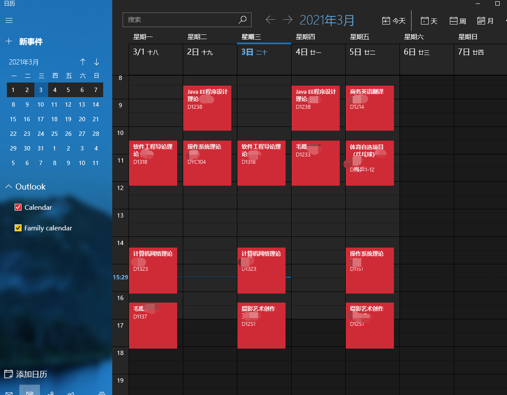

# CQU-class2ics

重庆大学 ics 课程表自动导出工具

## 项目介绍

ics 是最流行的日历文件之一，受到几乎所有日历软件的支持。  
这个程序能根据指定的提醒策略，将高校的课程表信息生成一个可以导入到各个日历软件的 ics 文件。

ics 同时可以导入至 windows 日历以外的系统日历软件，包括但不限于：
- Outlook
- macOS
- iOS
- 大部分安卓系统

## 为什么选择 ics

- 使用日历软件管理课程表可以让你不再把丑陋的课程表设置成桌面壁纸。
- 每节课上课前都会收到关于下一节课的提醒。（美观程度取决于系统和日历软件）
- 告别丑陋而繁琐的 WeCQU，查看课表一步化。
  
## 如何部署

请使用 pip 安装 `xlrd` 与 `xlwt`  
届于是否使用 xlsx，请选择合适的版本

如果运行的时候还缺了什么，请 pip / pip3 上。

## 如何运行

如果您是重庆大学本校学生，请按照以下步骤进行使用：
1. 登录`http://my.cqu.edu.cn/`
2. 进入选课管理界面
3. 切换至 `Network` 栏，刷新页面
4. 选择`register`栏，并将底部`Headers`中`Authorization`与`Cookie`填入`crawller.py`
5. 将学号填入`crawller.py`
6. 运行`crawller.py`
7. 运行`excelReader.py`
8. 运行`main.py`

如果您不是重庆大学学生，请手动创建 Excel 文件，并执行 5、6 步（详情请见参考项目）

## 关于

本项目修改于[ECNU-class2ics](https://github.com/BillChen2K/ECNU-class2ics/blob/master/readme.md)项目，感谢原作者做出的贡献：

Contributor|Website
---|---
Bill Chen|https://billc.io
Xiejiadong|http://xiejiadong.com/

爬虫部分由以下作者重写：

Contributor|Website
---|---
Bill Yang|https://bill.moe